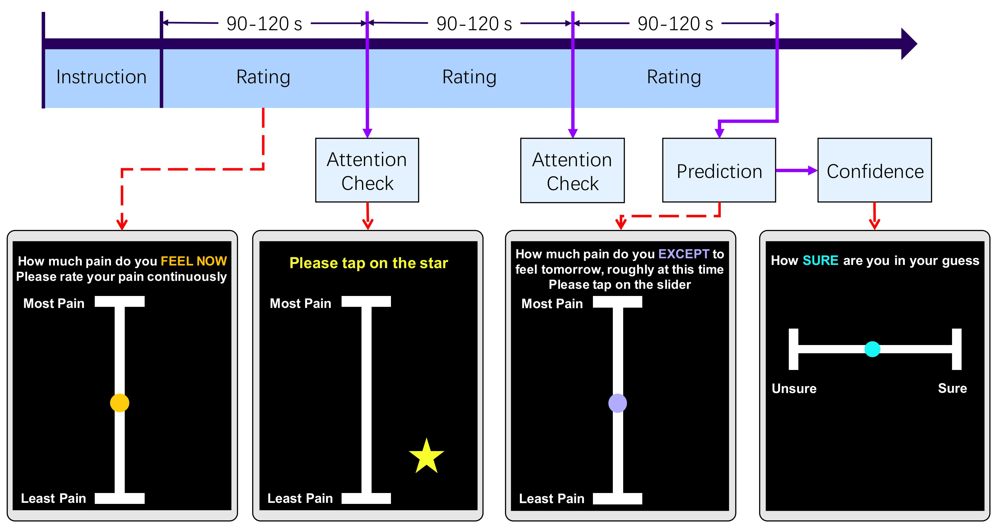

<h1 align="center"> Pain Monitoring Task</a></h1>
<h5 align="center"> If you like our project, please give us a star ⭐ on GitHub for the latest update.</h5>
<h5 align="center">
  

</h5>

This continuous pain rating task assesses pain intensity using the open-source software PsychoPy [1] hosted on Pavlovia [2]. At the start, participants are provided with detailed instructions and asked to complete a short practice run to ensure they understood how the application worked. Once this is completed, participants continuously rated their pain for approximately five minutes on a vertical scale ranging from "Least Pain" to "Most Pain."

The interface of the application and the experiment timeline are depicted in Figure 1:
<figure style="text-align: center;">
  
  <figcaption>Figure 1: Experimental Task Design.</figcaption>
</figure>

## 🏃‍♂️Running the Task 
1. Create an account on [pavlovia.org](https://gitlab.pavlovia.org/) 
2. Click on '+' sign on top navigation bar and select 'New project' option.
3. Select 'Import project' and then click on the 'Repo by URL' button
4. Paste our current [GitHub URL](https://github.com/swati-rajwal/pain_monitoring_task) under the 'Git repository URL' textbox. On the pavlovia page, you can rename the default 'Project name' to suit your project's requirements.
5. Voilà! The task is instantly ready to use for your experiment.

## 🎯Application
This task helped us collect pain ratings and highlight the importance of short-term variability in chronic musculoskeletal pain and its potential as a predictor of clinical outcomes. Please read our paper as cited below for more details.

### 📑Citation
Xuanci Zheng, Swati Rajwal, Sharon Yuen Shan Ho, Carl Ashworth, Ben Seymour, Nicholas Shenker, and Flavia Mancini, "_Hidden Rhythms of Chronic Musculoskeletal Pain_" unpublished manuscript, 2024. Available upon request.

Citation will be updated as soon as a preprint or publication is available

## 📚References

1. Peirce, J., Gray, J.R., Simpson, S. et al. *PsychoPy2: Experiments in behavior made easy.* Behav Res 51, 195–203 (2019). https://doi.org/10.3758/s13428-018-01193-y
2. Pavlovia. *Pavlovia*, https://pavlovia.org/. Accessed 10/09/024.
